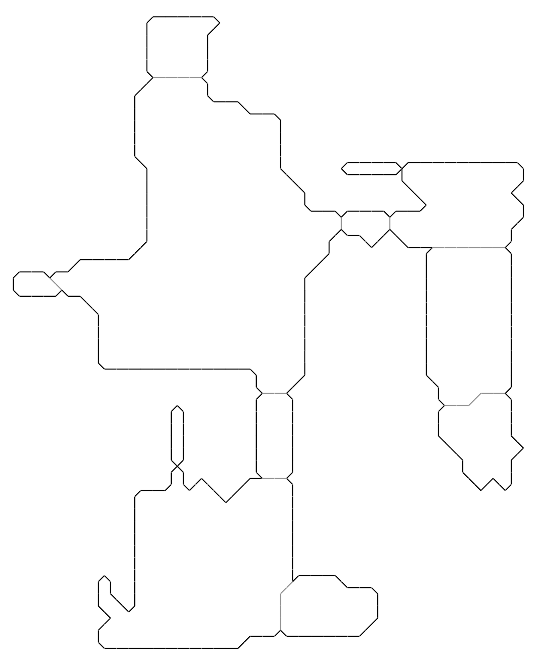

# DOOM level generation using GAN

This is a project developed at [Politecnico di Milano](www.polimi.it) by Edoardo Giacomello, [Pier Luca Lanzi](http://www.pierlucalanzi.net/), and [Daniele Loiacono](http://home.deib.polimi.it/loiacono/).
The project aims at investigating the generation of DOOM levels using Generative Adversarial Networks (GAN).
We trained two types of GAN on more than 1000 DOOM levels created by the community (available [here](https://doomwiki.org/wiki/Idgames_archive)) and, then, used them to generate novel levels.

[Report](https://arxiv.org/abs/1804.09154)

[Video](https://www.youtube.com/watch?v=K32FZ-tjQP4&t=4s)

An example of playable level (from the video):

[Download WAD](levels/example.wad)

Sets of raw levels:

[Set 1 (32 Levels)](levels/DoomGAN-Levels-Set1.zip)

[Set 2 (32 Levels)](levels/DoomGAN-Levels-Set2.zip)

## Code

See [DoomGAN Repository](https://github.com/edoardogiacomello/DoomGAN)
